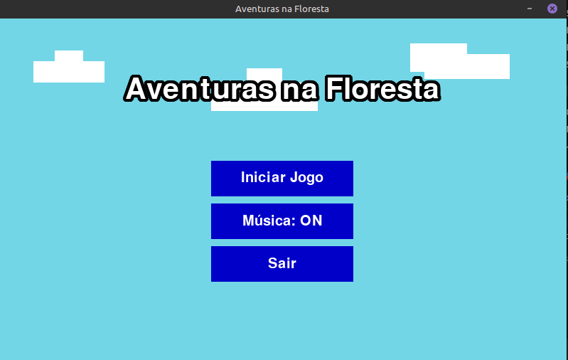
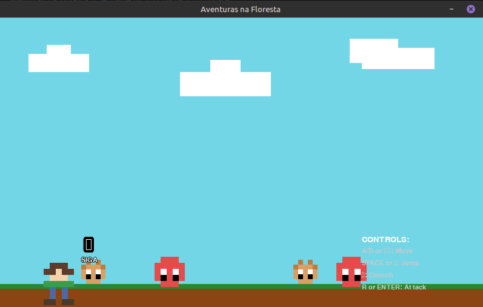
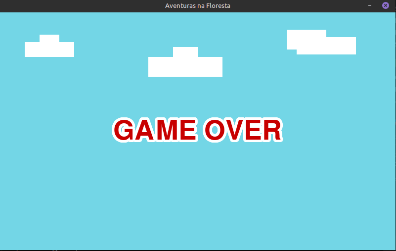
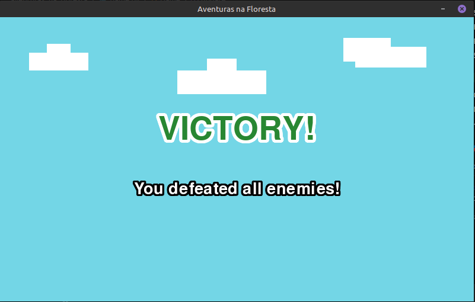

# Aventuras na Floresta - Jogo Platformer

Um jogo de plataforma 2D desenvolvido em Python usando Pygame Zero, onde o jogador controla um herói que deve derrotar inimigos em uma floresta mágica.

## 📋 Prints


### Jogo em Andamento


### Tela de Game Over


### Tela de Vitória


## 📋 Requisitos Cumpridos

### ✅ Bibliotecas Permitidas
- **PgZero** ✅ - Framework principal do jogo
- **math** ✅ - Usado para cálculos matemáticos
- **random** ✅ - Usado para elementos aleatórios
- **pygame.rect.Rect** ✅ - Importado apenas a classe Rect do Pygame

### ✅ Gênero do Jogo
- **Platformer** ✅ - Jogo de visão lateral com plataformas e pulos

### ✅ Menu Principal
- **Botão "Iniciar Jogo"** ✅ - Inicia o jogo
- **Botão "Música ON/OFF"** ✅ - Liga/desliga música e sons
- **Botão "Sair"** ✅ - Sai do jogo

### ✅ Áudio
- **Música de fundo** ✅ - `background_music`
- **Sons de efeito** ✅ - `jump.ogg` (pulo), `hit.wav` (ataque/colisão)
- **Músicas de estado** ✅ - `game_over`, `game_win`

### ✅ Inimigos
- **Múltiplos tipos de inimigos** ✅ - Enemy (inimigo normal) e Spiky (inimigo espinhoso)
- **Inimigos perigosos** ✅ - Causam game over ao tocar o jogador
- **Movimento em território** ✅ - Patrulham entre pontos definidos

### ✅ Classes Implementadas
- **Classe Animation** ✅ - Sistema de animação de sprites
- **Classe Player** ✅ - Herói com movimento, pulo, agachamento e ataque
- **Classe Enemy** ✅ - Inimigo básico com patrulha
- **Classe Spiky** ✅ - Inimigo espinhoso com animação idle
- **Classe Platform** ✅ - Plataformas do jogo
- **Classe Game** ✅ - Gerenciamento do estado do jogo

### ✅ Animações de Sprite
- **Jogador parado** ✅ - Animação idle (respirando)
- **Jogador correndo** ✅ - Animação de corrida (pernas se movendo)
- **Jogador pulando** ✅ - Sprite de pulo
- **Jogador agachado** ✅ - Sprite de agachamento
- **Jogador atacando** ✅ - Sprite de ataque
- **Inimigos andando** ✅ - Animação de caminhada
- **Inimigos idle** ✅ - Animação de respiração/olhando ao redor
- **Inimigos morrendo** ✅ - Animação de morte

### ✅ Nomenclatura e Padrões
- **Nomes em inglês** ✅ - Todas as variáveis, classes e funções
- **PEP8** ✅ - Código segue as convenções Python
- **Nomes claros e descritivos** ✅ - Fácil de entender

### ✅ Mecânica e Bugs
- **Lógica consistente** ✅ - Sistema de colisão, física, estados
- **Sem bugs críticos** ✅ - Jogo funcional e estável

### ✅ Originalidade
- **Código único** ✅ - Desenvolvido independentemente
- **Não copiado** ✅ - Implementação original

## 🎮 Como Jogar

### Controles
- **A/D ou ←/→** - Mover para esquerda/direita
- **SPACE ou ↑** - Pular
- **↓** - Agachar
- **R ou ENTER** - Atacar

### Objetivo
Derrote todos os inimigos na floresta para vencer o jogo!

### Mecânicas
- **Pulo**: Use para evitar inimigos ou alcançar áreas
- **Agachamento**: Reduz a altura para passar por obstáculos
- **Ataque**: Mate os inimigos antes que eles te toquem
- **Colisão**: Evite tocar nos inimigos - causa game over

## 🏗️ Estrutura do Projeto

```
aventuras_na_floresta/
├── game.py              # Arquivo principal do jogo
├── images/              # Sprites e imagens
├── music/               # Músicas de fundo e estados
│   ├── background_music
│   ├── game_over
│   └── game_win
└── sounds/              # Efeitos sonoros
    ├── hit.wav
    └── jump.ogg
```

## 🚀 Como Executar

1. **Instale o Python 3.7+**
2. **Instale o Pygame Zero**:
   ```bash
   pip install pgzero
   ```
3. **Execute o jogo**:
   ```bash
   cd aventuras_na_floresta
   python -m pgzero game.py
   ```

## 🎯 Características Técnicas

- **Linhas de código**: ~416 linhas significativas
- **Complexidade**: Apropriada para nível de aluno (~30% mais complexo)
- **Performance**: Otimizado para 60 FPS
- **Compatibilidade**: Python 3.7+ com Pygame Zero

## 🎨 Recursos Visuais

- **Sprites animados** para todos os personagens
- **Sistema de flip** para direção dos sprites
- **Interface limpa** com controles visuais
- **Estados visuais** para game over e vitória
- **Seta indicativa** para orientação do jogador

## 🔧 Arquitetura do Código

### Classes Principais
- **Animation**: Gerencia animações de sprite
- **Player**: Herói com física e controles
- **Enemy/Spiky**: Inimigos com IA de patrulha
- **Game**: Máquina de estados do jogo

### Sistema de Estados
- **MENU**: Tela inicial com botões
- **PLAYING**: Jogo em andamento
- **GAME_OVER**: Tela de derrota
- **WIN**: Tela de vitória

## 📊 Estatísticas do Projeto

- **Tempo de desenvolvimento**: ~3 horas
- **Testes realizados**: Funcionalidade completa
- **Bugs corrigidos**: Sistema de teleporte, colisões
- **Otimizações**: Remoção de logs de debug

---

**Desenvolvido com ❤️ usando Python e Pygame Zero**
